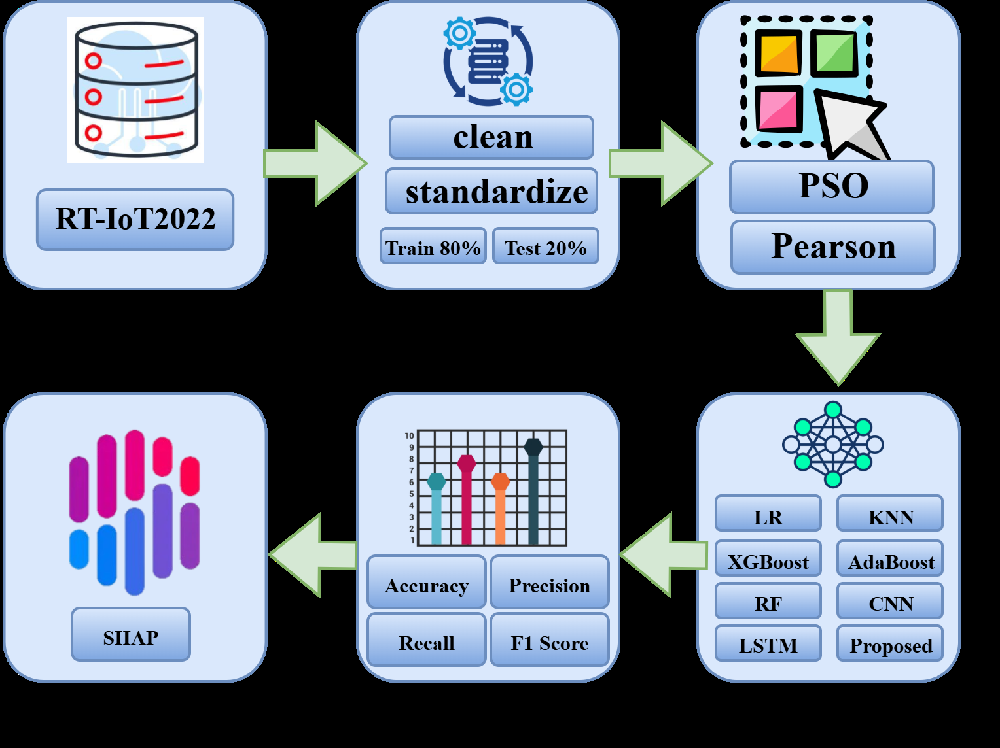
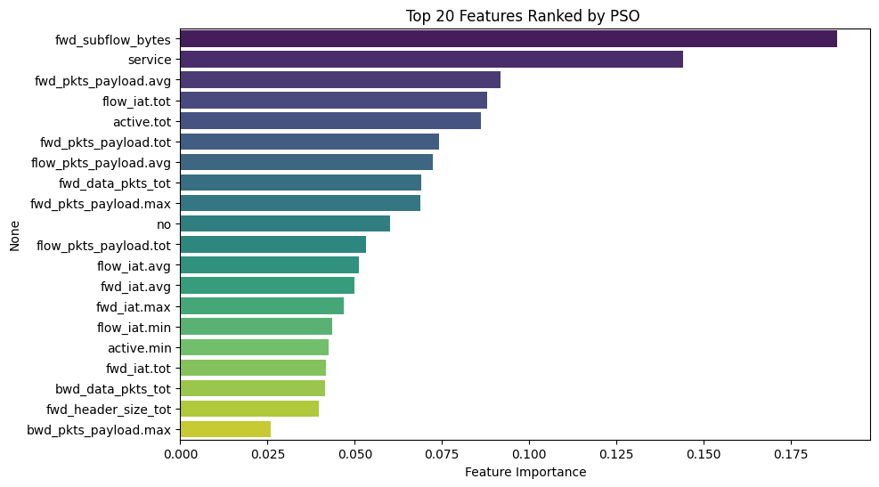
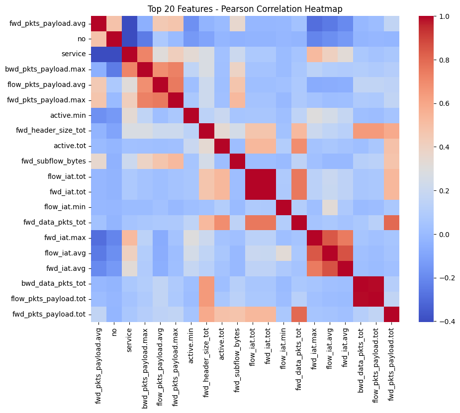
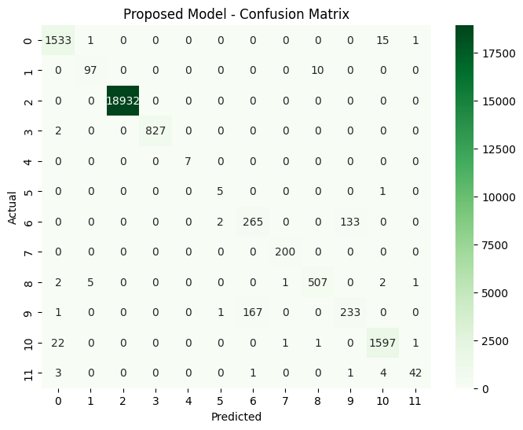
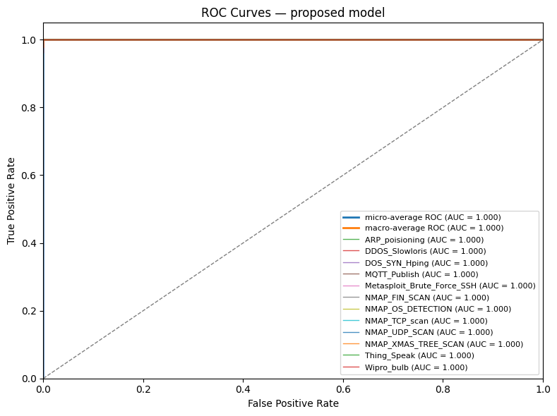
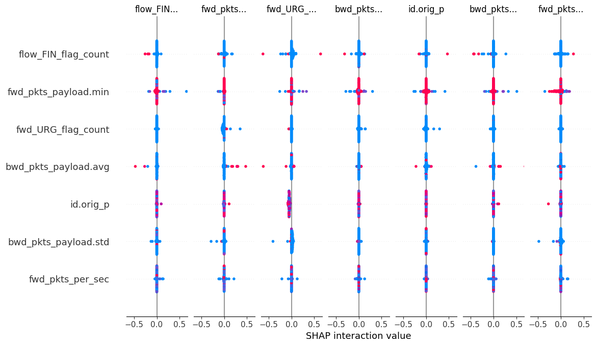

<!-- ╔══════════════════════════════════════════════════════════════════════════╗ -->
<!-- ║                              HEADER BANNER                                ║ -->
<!-- ╚══════════════════════════════════════════════════════════════════════════╝ -->

 

 

 

<!-- ╔══════════════════════════════════════════════════════════════════════════╗ -->
<!-- ║                              ABOUT ME                                     ║ -->
<!-- ╚══════════════════════════════════════════════════════════════════════════╝ -->

## About Me

- **B.Sc. & M.Sc. in Computer Science & Engineering** — *Comilla University*
- **IEEE Conference Author** at **RAAICON 2025** *(MIST, Dhaka)*
- Currently researching **Phishing Detection · IoT Security · Bengali NLP**
- Hands-on with **Industrial Automation (PLC & SCADA)**
- Ask me about **Deep Learning · Cybersecurity · Bengali NLP**
- **Goal:** publish more high-impact research bridging AI & security
- **Personal:** [priyansaiful@gmail.com](mailto:priyansaiful@gmail.com)
- **Academic:** [saifulislam.cse@stud.cou.ac.bd](mailto:saifulislam.cse@stud.cou.ac.bd)

 

---

<!-- ╔══════════════════════════════════════════════════════════════════════════╗ -->
<!-- ║                              TECH STACK                                   ║ -->
<!-- ╚══════════════════════════════════════════════════════════════════════════╝ -->

## Tech Arsenal

### Languages

### AI / Machine Learning / Deep Learning

 

### Data Science & NLP

### Cybersecurity & Tools

### Industrial Automation

### Tools & Platforms

---

<!-- ╔══════════════════════════════════════════════════════════════════════════╗ -->
<!-- ║                              CONTRIBUTION GRAPH                           ║ -->
<!-- ╚══════════════════════════════════════════════════════════════════════════╝ -->

## Contribution Graph

<table>
<tr>
<td align="center" width="33%">
  <h2></h2>
  Oct 13, 2024 — Present
</td>
<td align="center" width="33%">
  <h2></h2>
  Apr 29 — May 1
</td>
<td align="center" width="33%">
  <h2></h2>
  Mar 31 — Apr 6
</td>
</tr>
</table>

 

---

<!-- ╔══════════════════════════════════════════════════════════════════════════╗ -->
<!-- ║                              FEATURED PROJECTS                            ║ -->
<!-- ╚══════════════════════════════════════════════════════════════════════════╝ -->

## Featured Projects

<table align="center">
<tr>
<td width="50%" valign="top">

<h3 align="center">Bengali Hate Speech Detection</h3>

> NLP pipeline that detects hate speech in **low-resource Bengali text** using **TF-IDF**, **Word Embeddings**, and **Dropout regularization**.

<code>Python</code> · <code>TensorFlow</code> · <code>Keras</code> · <code>NLTK</code> · <code>Pandas</code>

</td>
<td width="50%" valign="top">

<h3 align="center">Phishing Detection System</h3>

> Hybrid **CNN-LSTM** model with engineered features that flags **homoglyph attacks** and social engineering URLs in real time.

<code>Python</code> · <code>TensorFlow</code> · <code>Scikit-Learn</code> · <code>NumPy</code>

</td>
</tr>
<tr>
<td width="50%" valign="top">

<h3 align="center">TB Detection (ResNet + EfficientNet)</h3>

> **Ensemble deep learning** model fusing ResNet & EfficientNet for automated **chest X-ray classification** of Tuberculosis.

<code>Python</code> · <code>TensorFlow</code> · <code>Keras</code> · <code>OpenCV</code>

</td>
<td width="50%" valign="top">

<h3 align="center">Hybrid PSO-CNN-XGBoost — IoT Security</h3>

> **PSO-optimized CNN-XGBoost** pipeline with **SHAP** explainability for IoT intrusion detection — **published at IEEE RAAICON 2025**.

<code>Python</code> · <code>TensorFlow</code> · <code>XGBoost</code> · <code>SHAP</code>

</td>
</tr>
</table>

---

<!-- ╔══════════════════════════════════════════════════════════════════════════╗ -->
<!-- ║                  IEEE RAAICON 2025 — FEATURED PUBLICATION                 ║ -->
<!-- ╚══════════════════════════════════════════════════════════════════════════╝ -->

## Featured Publication — IEEE RAAICON 2025

  

### *Hybrid Framework with Feature Selection and Explainable AI for IoT Intrusion Detection*

**4th IEEE International Conference on Robotics, Automation, AI, and IoT (RAAICON)** &nbsp;·&nbsp; 27–28 Nov 2025 &nbsp;·&nbsp; Military Institute of Science and Technology, Dhaka, Bangladesh

 

<table>
<tr>
<td>

> **Abstract.** We propose a hybrid framework that integrates **Particle Swarm Optimization (PSO)** for feature selection, a **Convolutional Neural Network (CNN)** for representation learning, and **XGBoost** for robust classification on the **RT-IoT2022** dataset. To improve transparency, **SHAP** is employed to reveal feature contributions at both global and local levels. The proposed model achieves **98.46% accuracy**, surpassing classical ML and standalone deep learning baselines.

</td>
</tr>
</table>

### Key Contributions

<table>
<tr>
<td width="33%" align="center">

<h4>PSO Feature Selection</h4>
Wrapper-based PSO reduces 83 → <b>20</b> most discriminative features, validated by Pearson correlation pruning.

</td>
<td width="33%" align="center">

<h4>Hybrid CNN → XGBoost</h4>
CNN learns dense embeddings; XGBoost classifies them — combining representation power with robust decision boundaries.

</td>
<td width="33%" align="center">

<h4>Explainability via SHAP</h4>
Global + local feature attribution reveals payload statistics and TCP flags as the primary attack indicators.

</td>
</tr>
</table>

### Results — Benchmarked Against 7 Baselines

| Model | Accuracy | Precision | Recall | F1-Score |
|---|:---:|:---:|:---:|:---:|
| Logistic Regression | 78.69% | 69.18% | 78.69% | 70.19% |
| K-Nearest Neighbors | 79.16% | 69.25% | 79.16% | 72.48% |
| AdaBoost | 84.58% | 87.77% | 84.58% | 83.80% |
| Random Forest | 93.57% | 91.47% | 93.57% | 92.44% |
| XGBoost | 96.50% | 96.56% | 96.50% | 96.32% |
| CNN | 97.53% | 96.73% | 97.53% | 96.96% |
| LSTM | 97.41% | 96.58% | 97.41% | 96.85% |
| **Proposed (PSO + CNN + XGBoost)** | **98.46%** | **98.46%** | **98.46%** | **98.46%** |

### Results Gallery

<table>
<tr>
<td align="center" width="50%">
  
  <b>Fig. 1 &nbsp; · &nbsp; Proposed Framework Workflow</b> RT-IoT2022 → Preprocessing → PSO + Pearson → Models → Metrics → SHAP
</td>
<td align="center" width="50%">
  
  <b>Fig. 2 &nbsp; · &nbsp; Top 20 Features Ranked by PSO</b> fwd_subflow_bytes, service, fwd_pkts_payload.avg lead the ranking
</td>
</tr>
<tr>
<td align="center" width="50%">
  
  <b>Fig. 3 &nbsp; · &nbsp; Pearson Correlation Heatmap</b> Block-diagonal redundancy reveals features pruned for multicollinearity
</td>
<td align="center" width="50%">
  
  <b>Fig. 4 &nbsp; · &nbsp; Confusion Matrix</b> Strong diagonal — near-perfect classification across 12 attack types
</td>
</tr>
<tr>
<td align="center" width="50%">
  
  <b>Fig. 5 &nbsp; · &nbsp; ROC Curves (AUC = 1.000)</b> Micro & macro-averaged AUC reach 1.000 across all classes
</td>
<td align="center" width="50%">
  
  <b>Fig. 6 &nbsp; · &nbsp; SHAP Interaction Values</b> Payload stats + TCP flag counts dominate attack-class predictions
</td>
</tr>
</table>

---

<!-- ╔══════════════════════════════════════════════════════════════════════════╗ -->
<!-- ║                              ALL PUBLICATIONS                             ║ -->
<!-- ╚══════════════════════════════════════════════════════════════════════════╝ -->

## All Publications & Research

| Title | Venue | Domain | Year |
|---|---|---|---|
| **Hybrid Framework with Feature Selection and Explainable AI for IoT Intrusion Detection** | *IEEE RAAICON 2025 — MIST, Dhaka* | IoT • Cybersecurity • XAI | 2025 |
| **Phishing Detection using LSTM & Feature Engineering** | *Conference Paper* | Cybersecurity • DL | 2025 |
| **Bengali NLP Classification System for Hate Speech** | *Research Project* | NLP • Low-Resource | 2024 |

---

<!-- ╔══════════════════════════════════════════════════════════════════════════╗ -->
<!-- ║                              CONNECT                                      ║ -->
<!-- ╚══════════════════════════════════════════════════════════════════════════╝ -->

## Let's Connect

I'm always open to **research collaborations**, **open-source contributions**, and **AI / Cybersecurity discussions**. 
Drop a message — let's build something impactful together!

  

---

<!-- ╔══════════════════════════════════════════════════════════════════════════╗ -->
<!-- ║                              FOOTER                                       ║ -->
<!-- ╚══════════════════════════════════════════════════════════════════════════╝ -->

From <a href="https://github.com/saifulislampriyan">saifulislampriyan</a> — if you find my work useful, drop a star on my repos!

